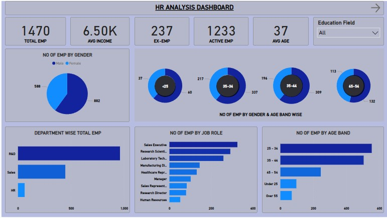
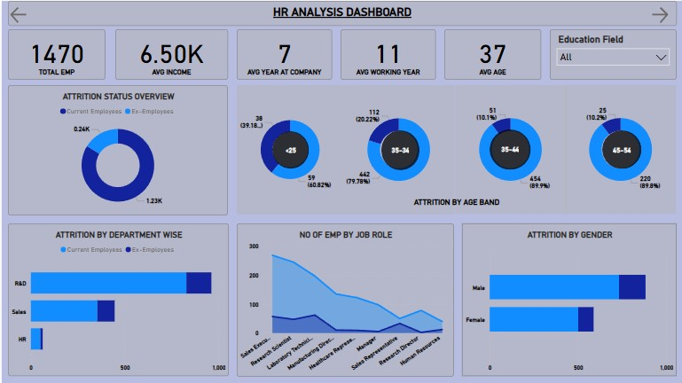

# HR Analysis Dashboard

This Power BI dashboard provides a comprehensive analysis of HR data to help organizations understand key workforce metrics such as attrition, job satisfaction, salary trends, and department-level breakdowns.

##About Me

Hi, I'm **Rajkamal Jaiswar**, a data enthusiast with a passion for turning raw data into meaningful insights. I enjoy working on business intelligence projects that solve real-world problems and drive data-informed decisions.
🔗 Connect with me on [LinkedIn](https://www.linkedin.com/in/rajkamal-jaiswar)

---
## 📊 Dashboard Overview

The **HR Analysis Dashboard** enables HR professionals and business leaders to:

- Monitor employee attrition trends
- Analyze average income across job roles
- Visualize job satisfaction by department
- Track workforce distribution by age and gender
- Identify potential areas of improvement in employee retention
---

## 🧰 Tools & Technologies

| Tool         | Description                      |
|--------------|----------------------------------|
| **Power BI** | Data visualization and reporting |
| **DAX**      | Calculated measures and KPIs     |
| **Excel/CSV**| Data source used for analysis    |
---

## 📸 Screenshot

---
## 📌 Key Insights Uncovered

- Departments with the highest attrition rates
- Impact of job level and job satisfaction on income
- Demographics of the workforce
- Role-based salary distributions

---

## 🙌 Contributing

If you find any issues or have suggestions for improvements, feel free to fork this repository, make changes, and create a pull request.

---

## 📬 Contact

**Rajkamal Jaiswar**  
🔗 [LinkedIn](https://www.linkedin.com/in/rajkamal-jaiswar)

---

⭐️ *If you found this project helpful, feel free to star the repository to show your support!*
