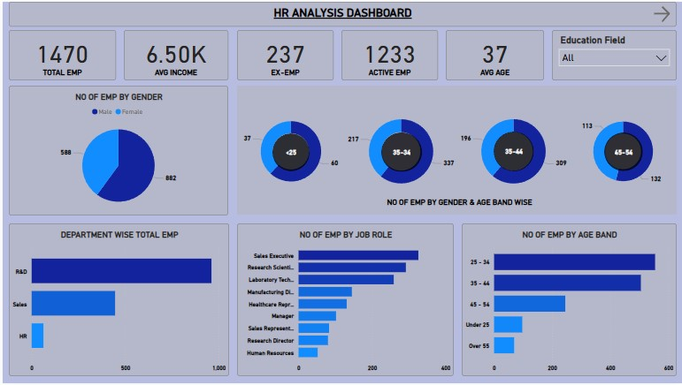
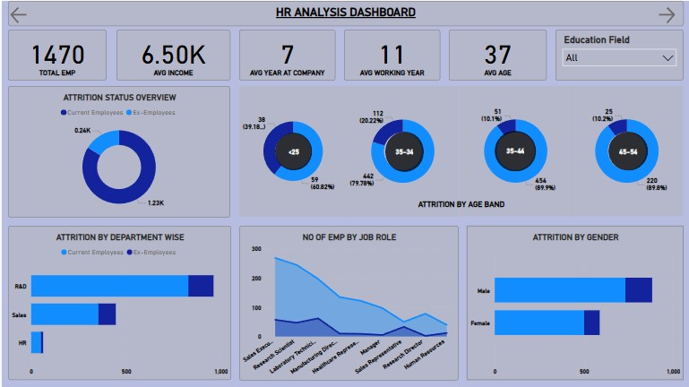
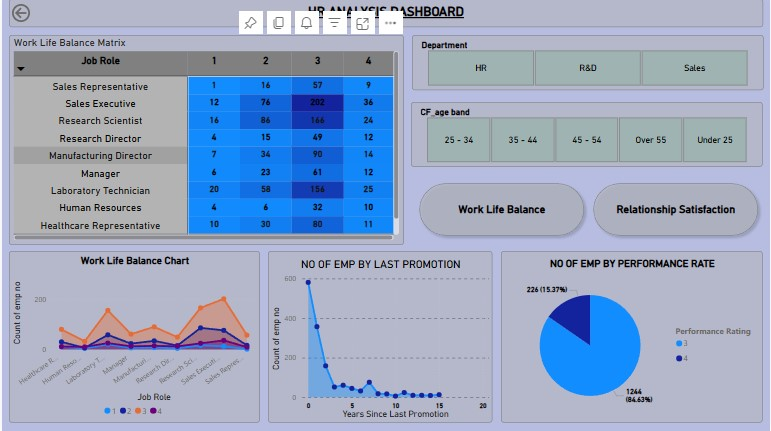

# HR Analysis Dashboard

This Power BI dashboard provides insights into HR data including attrition rate, job satisfaction, average income, and more.

## 📊 Dashboard Features
- Attrition breakdown by department
- Employee age distribution
- Salary analysis by job role
- And other HR metrics

## 🛠️ Tools Used
- Power BI
- DAX
- HR Dataset

## 📁 File Included
- `HR_ANALYSIS_DASHBOARD.pbix`: Power BI report file

## 📸 Screenshot

